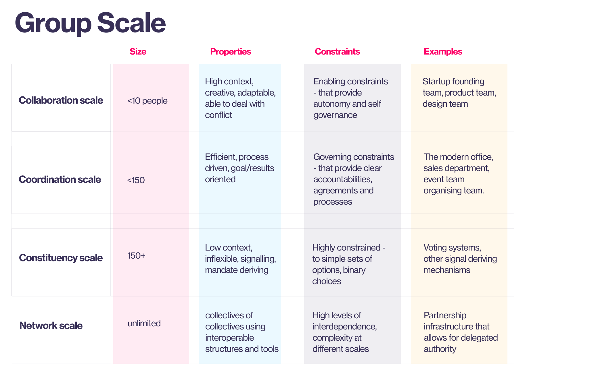

# Group Scale

Human systems function differently at different scales. Understanding these differences is crucial for designing organizational systems that function effectively, regardless of size. This framework identifies four key scales of [[../../../../tags/groups|group]] organization, each with its own characteristics, challenges, and best [[../../../../tags/practices|practices]]:

- [Collaboration Scale](./collaboration-scale.md#)
- [Coordination Scale](./coordination-scale.md#)
- [Constituency Scale](./constituency-scale.md#)
- [Network Scale](./network-scale.md#)

.png)

When creating decentralized [[../../../../tags/networks|networks]] of autonomous teams, it is important to design for the different group scales that will occur. This way, different [[../../../../tags/groups|groups]] across a [[../../../../tags/networks|network]] can operate effectively as separate entities, and also [[../../../../tags/coordination|coordinate]] together effectively to create a collectively intelligent whole.

---

## Collaboration Scale

[Collaboration scale](./collaboration-scale.md#.md#) represents the smallest and most fundamental level of [[../../../../tags/groups|group]] organization. It is characterized by direct, face-to-face interaction among a small number of individuals (generally under 10) working together towards a shared [[../../../../tags/purpose|goal]]. Effective collaboration at this scale relies on strong interpersonal relationships, clear communication, and shared understanding.

## Coordination Scale

[Coordination scale](./coordination-scale.md#.md#) involves multiple teams or smaller [[../../../../tags/groups|groups]] working together towards a shared [[../../../../tags/purpose|goal]], requiring more sophisticated [[../../../../tags/coordination|coordination]] mechanisms and communication strategies. This scale typically ranges from 10 to 150 individuals, although this can vary depending on the complexity of the task and the effectiveness of coordination mechanisms.

## Constituency Scale

[Constituency scale](./constituency-scale.md#.md#) encompasses a large and diverse group of stakeholders who share a common interest or benefit from the organization's activities. Unlike smaller scales, this scale emphasizes participation, representation, and collective [[../../../../tags/decisions|decision-making]] across a wider [[../../../../tags/community|community]].

## Network Scale

[Network scale](./network-scale.md#.md#) represents the largest and most complex level of [[../../../../tags/groups|group]] organization, encompassing a system of interconnected organizations or [[../../../../tags/groups|groups]] (constituencies) working together towards shared or complementary [[../../../../tags/purpose|goals]]. This scale is characterized by high levels of interdependence, complex communication flows, and the need for robust mechanisms for [[../../../../tags/coordination|coordination]] and [[../../../../tags/governance|governance]] across multiple entities.
