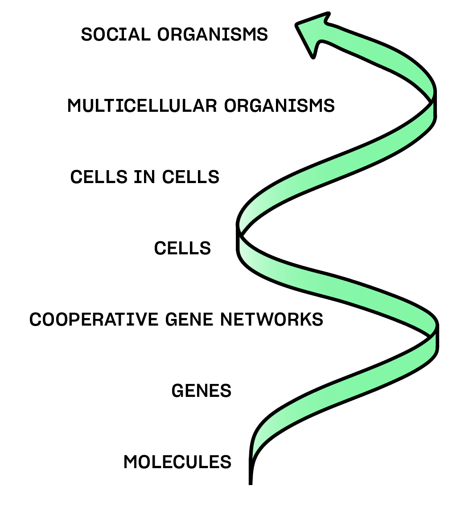

> “It is now highly feasible to take care of everybody on Earth at a 'higher standard of living than any have ever known.' It no longer has to be you or me. Selfishness is unnecessary and henceforth unrationalizable as mandated by survival.” — R. Buckminster Fuller

## Making The Old System Obsolete

^c1956a

Together, these enabling structures, composed of interoperable civic utilities, form new kinds of civic systems. These systems may be hard for us to conceive at present, given just how degraded our civil society and commons have become. But as our current systems continue to crumble around us, our imagination is the primary limitation on the kind of world that we can create next. Open civic systems simply make old systems obsolete by providing a higher quality of life for citizens by making better use out of existing resources, leveraging local knowledge and problem-solving, and anchoring networks of relationships. With this possibility as our north star, we peer ahead, beyond the horizon of our current systems, towards the rising sun of the third attractor.

Instead of fighting the existing world order, we can embrace the fact that it is already crumbling under its own weight. While holding actions are still needed to mitigate harm, we can soften into the liberation of knowing that our legacy systems are already actively undermining themselves through their increasingly evident contradictions and inability to effectively respond to mounting existential risks. Focusing on the fundamental building blocks that make a parallel society and economy possible, our energy can be channeled into producing localized systems that empower us to gradually withdraw our consent and participation from legacy systems.

## Three Horizons & The Third Attractor

^81800c

Within the [three horizons framework](https://training.itcilo.org/delta/Foresight/3-Horizons.pdf) approach to change management and paradigmatic shifts, the first horizon (H1) represents business as usual. The second horizon (H2) represents adaptations that occur in response to the failures of the status quo. These adaptations can prolong the dysfunction of the status quo by marginally addressing its insufficiencies (H2-) or they can create the enabling conditions for an entirely new horizon (H3) to emerge (H2+).

An analysis of the depth and scope of the meta-crisis’ generator functions reveals that H2- innovations are not only ‘too little, too late’ when it comes to addressing the perverse economic incentives and regulatory capture that drive ecocide and anti-social behaviors, they're also likely to prolong the long disaster that we're currently embedded within. As such, it is critical to describe the third horizon or third attractor in greater detail, both to ensure any transitional approaches are indeed H2+, and to guide a process of distributed coordination towards the underlying frameworks and initiatives that will increase the probability of the third attractor’s emergence.

This section of the thesis attempts to define the third horizon in the form of open civic systems, a design philosophy based on the indicators and design principles of a life-affirming civilization.

Open refers to a design philosophy akin to the design of [open source software](https://www.sciencedirect.com/science/article/pii/S1471772723000532). To empower truly distributed coordination in the re-imagination of our core civilizational systems, an open design approach enables any participant to modify, fork, or merge a design pattern in an evolutionary process of adaptation and natural selection.

Civic refers to the systems of care that undergird the incentives, infrastructures, and institutions of any given civilization. By focusing our attention on these underlying systems, we are able to shape the downstream flows of our democracies and economies.

According to Donella Meadows, “a system is a set of things—people, cells, molecules, or whatever—interconnected in such a way that they produce their own pattern of behavior over time. The system may be buffeted, constricted, triggered, or driven by outside forces. But the system’s response to these forces is characteristic of itself.” In short, a system is a set of feedback loops between components that produce their own emergent behaviors and effects. Thinking in terms of systems, instead of in terms of individual components, is essential to meaningfully and effectively engage with the complexity of our world.

The sections that follow will provide an overview of open civic systems as a precursor for a distributed coordination framework for the development and deployment of such systems.

## Conditions of the Third Attractor

^569a96

Open civic systems require three primary conditions – based on the design principles of a third attractor – in order to avoid unintentionally reproducing the self-destructive qualities of our current civilization. Our critical path towards a life-affirming civilization is defined by self-correcting feedback loops, aligned incentives, and civic culture.

Self-correcting feedback loops refers to truly [participatory democracy](https://en.wikipedia.org/wiki/Participatory_democracy) paired with a sufficiently educated public to interpret the holistic impact of our collective agency. Distributed, powerful, collective agency that is able to make decisions based on high quality and holistic sensing of ecological data and wisdom is required to ensure that any unhealthy feedback loops that may emerge at any point in our collective future can be addressed and mitigated holistically. This can be achieved through direct democracy mechanisms, citizen assemblies, strong public education, traditional ecological knowledge and open socio-ecological data.

Aligned incentives refers to an incentive landscape in which individual self-interest is aligned with the collective interest of humanity and all Life on Earth. Pro-social incentives reward forms of value that create cascading benefits for humanity and the planet. Unlike our current incentive landscape which rewards extraction and enclosure of value, prosocial incentives reward contributions to the commons and markets that produce holistic well-being and mutual thriving. This can be achieved through an economic structure organized by democratically governed worker-owned cooperatives, nature-backed currencies, and evaluative metrics like [Gross National Happiness](https://ophi.org.uk/gross-national-happiness).

Civic culture refers to the revival of a culture of mutual stewardship and responsibility. Renewing our sense of mutuality and solidarity is a critical precursor to any of the downstream behavioral and socio-economic shifts described above. Deconstructing the weaponized culture war dynamics that are currently being leveraged to reduce collective agency by pitting identity groups against one another can be effectively achieved through the lens of bioregionalism, a philosophy that invokes our mutual belonging to the places we call home as a fundamental basis for solidarity. Civic utilities like informal solidarity networks, connected locally and globally, that share resources and provide grassroots coordination for mutual benefit are among the tools that could support this civic renaissance.

## System Composition

^12eede

Our current system composition is defined by institutions, infrastructure, incentives, interactions and culture – whose systemic failure modes have been described extensively above.

To reimagine our systems in the context of an open and composable approach, it is necessary to understand how these three components currently exist and how they might be transformed.

### Components

**Institutions (Functions)**

Institutions are the structured roles, rules, and norms that govern the behavior and interactions within the system. These are the formal and informal systems that provide stability, enforce policies, and guide decision-making processes.

**Infrastructure (Utilities)**

Infrastructure represents the physical and digital systems, tools, and facilities that support the system’s operations. These utilities enable the functioning of the system’s core activities and ensure that resources are effectively utilized.

**Incentives (Mechanisms)**

Incentives are the mechanisms designed to motivate and encourage desired behaviors and outcomes within the system. These can be financial rewards, recognition programs, advancement opportunities, or any other forms of motivation that align individual actions with systems goals.

**Interactions (Flows)**

Interactions refer to the dynamic flows of information, communication, and resources between different parts of the system. These flows ensure coordination, collaboration, and feedback among the various subsystems, enabling the system to function cohesively.

**Culture (DNA)**

Culture represents the underlying values, beliefs, and norms that shape the behavior and mindset of individuals within the system. Culture is a kind of social DNA of the system, influencing how people interact, make decisions, and approach their work.

### Transformations

In an open civic system, institutions are transformed into extitutions, extractive incentives are transformed into prosocial incentives, and infrastructures are transformed into open protocols.

**Institutions to Extitutions**

[Extitutions](https://extitutions.org) are frameworks for self-organization that provision the same services as traditional institutions through participatory coordination mechanisms. Instead of relying on enclosure to centrally coordinate these services and utilities, extitutions rely on open protocols to coordinate the provisioning of essential services through the web of relationships between members of the public.

Whereas bureaucratic mechanisms were developed to ensure quality and reliability of core civic utilities and services, extitutions take a more agile and consent-based approach that invites members of the public to elect into acts of service using decentralized mechanisms for attribution and compensation.

What these open frameworks lack in centralized management, they compensate for through transparency and choice. If a service becomes unreliable or poorly managed, citizens may utilize the open protocol framework to self-organize an alternative.

Examples of extitutions abound in crisis scenarios when centralized institutions are unable or unwilling to provision a core civilizational service, placing the burden of responsibility on everyday citizens to self-organize their own solutions.

**Extractive Incentives to Prosocial Incentives**

[Prosocial incentives](https://rbenabou.scholar.princeton.edu/sites/g/files/toruqf3331/files/rbenabou/files/aer_2006.pdf) align positive feedback with holistic markers of wellbeing for individuals, communities, and ecologies. Such incentives would acknowledge the disproportionate value of a living tree when compared with the value of the lumber generated by its extraction.

Prosocial incentives can be designed into new types of markets that provide economic value to previously uncompensated actions or they can be embedded into currency models that reflect prosocial values. Incentives can also be aligned through the design of financial instruments that autonomously reward specified actions that are reported and verified by peers.

Reputation systems are another form of prosocial incentive in which trust networks provide a means of visualizing the prosociality of peers. Prosocial incentives are a decentralized response to the effects of extractive incentives landscapes in which unregulated market demand drives multi-polar traps, but instead of addressing these market failures with top down regulation, they instead attempt to link rational self-interest with mutual benefit through decentralized means.

**Fragmented Infrastructure to Networked Open Protocols**

[Open protocols](https://mirror.xyz/openprotocolresearch.eth) are the DNA of the social organisms that make up exititutions. By their very nature, they are non-enclosable and non-rivalrous patterns of human self-organization that can be modified and adapted.

Essentially a recipe book for particular forms of collective agency, they can be composed and restructured based upon local needs and “ingredients.” By utilizing the same underlying pattern language, open protocols become an evolutionary phenomenon. Just as DNA composed of the same underlying proteins can be combined to create trees, whales, and humans, so too can open protocols be utilized to create community food sovereignty networks, home school associations, and communal maker spaces.

These patterns can evolve like DNA through the same process of natural selection that occurs in other living systems. Viewing infrastructure in this way, we evolve our understanding of infrastructures as simply a physical substrate in the form of roads or cables towards infrastructures as conceptual frameworks for physical coordination. Open protocols can still be utilized to provision large scale physical infrastructures, but their design implies a fundamental shift from top down coordination to bottom up coordination to meet the same needs.

Importantly, to achieve these ends, humanity must align upon an open pattern language for these protocols to ensure their scalability and replicability across differences and support innovators as they collaborate towards the interoperability and composability of the mechanisms they create.

## System Design Principles

^9ec3aa

As civic innovators build and deploy open protocols, civic utilities, and civic stacks that collectively form the civic [hyper-structure](https://jacob.energy/hyperstructures.html) of an open civic system, the following principles will be vital to ensure the strategic viability of such approaches. These characteristics or qualities are critical to ensure both theoretical and practical alignment with the open civic system design philosophy.

Modular refers to the design principle whereby a system is divided into separate, self-contained units or modules. Each module can function independently but can also be combined with other modules to create a more complex system. This approach allows for flexibility, scalability, and ease of maintenance, as individual modules can be updated or replaced without affecting the entire system. Modularity also empowers local communities to self-assemble their own compositions of various modules to meet their own needs based on their own goals and priorities.

Composable refers to the capability of any modular component of a system to be modified according to various parameters, enabling components to be configured to meet specific needs. In the context of open civic systems, composability allows for the fine tuning of modules to increase their adaptability and customization based on the unique requirements of different communities or projects.

Inclusivity ensures that the system is accessible and usable by all individuals, regardless of their background, abilities, or circumstances. In open civic systems, inclusivity involves designing with diverse user needs in mind, promoting equity, and ensuring that everyone can participate in and benefit from the system. This includes considerations for accessibility, language, and cultural relevance.

Interoperable describes the ability of different systems, organizations, or components to work together seamlessly. In open civic systems, interoperability ensures that various modules or platforms can exchange information and function together effectively, regardless of their underlying technologies or architectures. This is crucial for creating cohesive and efficient civic hyper-structures.

## System Design Ethics

^632ad4

The end goal of open civic systems is not simply a mental exercise in alternative systems design. Open civic systems are inherently designed to increase the capacity for self-correction that would directly empower citizens to move towards health and wellbeing.

To evaluate the success or failure of any open civic system, a triad of qualitative indicators are necessary as a rubric for a healthy civilization. These heath indicators, or system design ethics, shouldn’t be considered as separate domains but rather as interconnected criteria for holistic evaluation of systemic adaptation and design.

### **Resilience**

**Resilience is the state and the capacity for adaptive self-organization sufficient to provide core life support function across changing world circumstances.

As things change over time, resilience ensures we have the ability to adjust and adapt without compromising our essential needs. The philosophy of decentralization is inherent to the philosophy of resilience, because centralized structures are fragile and non-adaptive whereas decentralized structures are modular, adaptive, and redundant to ensure their ongoing function as circumstances stress the integrity of a system. For example, imagine compostable bioplastic 3D printer micro manufacturing to minimize dependencies on international industrial supply chains. The creation of decentralized local infrastructure allows us to more easily meet needs locally and adapt to change.

Examples of indicators of resilience include:

- Diversity
- Redundancy
- Adaptive Capacity
- Interconnectivity

### **Choice**

**Choice is the state of fundamental respect for the sovereign agency of all beings and the capacity of individual agents to express their agency and influence their circumstances.**

Designing for choice compels us to design systems that support agency, not constrict or take it away. Systems of self-definition are systems in which agents opt-in and choose how they want to participate. Choice also implies that agents have the ability to assert their will and change their situation if they are not satisfied or fulfilled. In Elinor Ostrom's foundational work on governing the commons, she states that people who are affected by a governance structure should be able to participate in it and modify it. Choice is fundamental because unless all agents are able to participate in the design and application of our systems, systems designers may leave out critical capacities and inclusions by not consulting or engaging with particular communities, producing unhealthy cultures of dominance.

Examples of indicators of choice include:

- Opt-in and opt-out mechanisms
- Flexible participation levels
- Participatory decision making
- Feedback and conflict resolution mechanisms
- Modularity and composability
- Access to information and data self-custody

### **Vitality**

**Vitality is Life’s capacity to create more Life, the embodied state of thriving that emerges from the interconnected levels of well-being and quality of life for individuals, communities, and ecologies.

Vitality is based on the indigenous [Quechua](https://en.wikipedia.org/wiki/Quechuan_languages) principle of Sumak kawsay, which means “I am well because you are well”. This implies that our ecological, communal, and individual thriving are bound together. For truly holistic thriving to occur, a system must concern itself with the all interconnected scales and expressions of wellbeing.

Examples of indicators of vitality include:

- Cultural diversity
- Engagement
- Community vitality
- Ecological diversity and resilience
- Living standards
- Psychological well-being
- Self-reported physical health
- Use of time
- Education

## Stigmergy: The Nature Of Open Civic Systems

^637efd

Across the natural world, we can see examples of nature engaging in positive sum feedback loops in which plants, animals, fungi, bacteria, water, light, and soil exchange energy and information for mutual benefit. The sum total of these interactions is the “web of Life,” a nested set of relationships that form a complex adaptive system that is self-regulating, self-healing, self-reinforcing, and continuously evolving.

> “The concept of stigmergy has been used to analyze self-organizing activities in an ever-widening range of domains, including social insects, robotics, web communities and human society. Yet, it is still poorly understood and as such its full power remains under-appreciated. This paper… [defines] stigmergy as a mechanism of indirect coordination in which the trace left by an action in a medium stimulates subsequent actions… [Stigmergy] enables complex, coordinated activity without any need for planning, control, communication, simultaneous presence, or even mutual awareness. The resulting self-organization is driven by a combination of positive and negative feedbacks, amplifying beneficial developments while suppressing errors. Thus, stigmergy is applicable to a very broad variety of cases, from chemical reactions to bodily coordination and Internet-supported collaboration in Wikipedia.”

– **Stigmergy as a universal coordination mechanism I: Definition and components by Francis Heylighen**

Stigmergy is a type of [swarm intelligence](https://vimeo.com/78043173) in which individual agents, taking their own actions, signal those actions to other agents in such a way that other agents can contribute in a positive sum feedback loop. Examples of stigmergy in non-human organisms include ants, termites, bees, flocks of birds, bacteria, and slime mold. In humans, we can see examples of stigmergy in Burning Man, [open source software development](https://blog.ubiquity.acm.org/why-cant-programmers-be-more-like-ants-or-a-lesson-in-stigmergy/), [Wikipedia](https://www.researchgate.net/publication/283356364_Longing_for_Wikitopia_The_study_and_politics_of_self-organisation), [the Occupy movement](https://theanarchistlibrary.org/library/kevin-carson-the-stigmergic-revolution), and [various internet experiments](https://uwspace.uwaterloo.ca/bitstream/handle/10012/14060/Armstrong_Ben.pdf). More akin to jazz music or an improv troupe than an institution or organization, stigmergy uses a simple set of decentralized rules to support individual agents in contributing to mutually beneficial goals. What is lost in terms of the linear clarity derived from centralized planning and control is greatly outweighed by the unplannable complexity and beauty of a swarm contributing their unique gifts towards an emergent structure.

Stigmergy is made possible by the decentralized rule set that all agents choose to abide by, creating the conditions for feedback loops that reward positive sum behaviors. At Burning Man, these rules are the boundaries of the city and the grid of city streets as well as the [10 Principles](https://burningman.org/about/10-principles/) that are upheld by peer accountability. In jazz, these rules are music theory, rhythm, and tuning. In Wikipedia, these rules are based around editorial review, appropriate citation, grammar, and dynamic linking between related concepts. In improv comedy, these rules are “yes, and,” narrative development, and the building/release of comedic tension.

In all of these instances, the positive sum feedback is mostly driven by contributions and alignment. Contributions that attract more contributions feed back on themselves. These rewards are intrinsic to participation. No one needs to direct or command them to occur. When it is clear how to contribute without stepping on someone else’s toes (literally or metaphorically), humans naturally want to converge around shared efforts in which their participation is meaningful and purposeful. This is a form of [participatory commons](https://docs.google.com/document/d/1U2VoanEaEoZDyURUqpDemu9Kwb6kroZougl_6t5XYB4/edit?tab=t.0) governance in the sense that it empowers us to collectively steer the ship of a common effort through our contribution instead of through our top down control of others’ agency.

Open civic systems create scaffolding for stigmergic coordination by providing open templates for agent-centric coordination. Institutional functions and all other functions of a society are ultimately based in human coordination, making open civic systems capable of achieving the same outputs as any centralized institution. Open protocols, the DNA or source code for open civic systems, function similarly to the pheromone pattern languages of ants that inform how agents communicate and stack their contributions. In this way, open civic systems integrate human social systems with the patterns of living systems.

In the same way that an ant colony or bee hive can be considered a macroorganism, an emergent whole with its own form of collective agency, a human social organism is the equivalent design pattern for human coordination. Social organisms grow out of a core mission, vision, and culture that is defined in the nucleus of the social organism’s social DNA. This social DNA serves as a north star as it is encoded and reproduced by agents through means of peer accountability, empowering human agents to opt-in to social organisms with whom they align at the fundamental DNA level. This core DNA also informs the functions, roles, flows, and membranes that are required for the social organism to achieve its purpose within its social ecology. Distinct from institutions or corporations that tend to function as a kind of “zombie” or cancerous social organism, never dying or engaging in reciprocal flows with their environment, social organisms are intended to be conceived, gestated, matured, and decomposed as the entire social ecology continues to evolve and transform to reflect the needs and desires of the many generations of agents who animate them.

While this fundamental transformation in human social behavior and structure is profound, it reflects patterns that exist all around us in the natural world. A human civilization based on these fundamental design patterns would represent a truly open civic system, able to easily adapt to changing circumstances, respond to collectively determined needs, and provide cosmo-local feedback cycles in which the collective superorganism of humanity could continuously learn and grow as peers.

## Polycentricity: Holons Of Self-Organization

^1bf89e

Embracing the living systems view of the interrelatedness and complexity present in our ecologies, and perhaps our future human systems, we begin to view components of a system as nested wholes or holons.

> “A holon is something that is simultaneously a whole in and of itself, as well as a part of a larger whole. In this way, a holon can be considered a [subsystem](https://en.wikipedia.org/wiki/Subsystem) within a larger [hierarchical](https://en.wikipedia.org/wiki/Hierarchy) system” – **Wikipedia**

This fractal perspective allows us to view the world through the lens of polycentricity, a way of seeing that can contextually shift depending on which holon we’re seeking to understand. Because each component is a whole unto itself within a fractal web of relationships, polycentricity emerges as a way of engaging with the sovereign sphere of each holon while acknowledging that a complex system will contain many component parts which are themselves sovereign wholes. This whole systems approach allows us to engage with and design human systems that reflect the various interconnected holonic scales of a complex system, from the sub-atomic to the molecular, cellular, organismic, social organismic, ecological and biospheric scales. At each scale, the autonomy and healthy reciprocal flows within and across each holon will affect the health of the system. 

This living systems understanding is reflected in political philosophy through the principle of [subsidiarity](https://en.wikipedia.org/wiki/Subsidiarity), an idea which emerged out of the [natural law philosophy](https://scholarship.law.nd.edu/cgi/viewcontent.cgi?article=1032&context=nd_naturallaw_forum) of Thomas Aquinas and the neo-Calvinist political philosophy of [“sphere sovereignty,”](https://en.wikipedia.org/wiki/Sphere_sovereignty) which states that “social and political issues should be dealt with at the most immediate or local level that is consistent with their resolution.”

[Alexis de Tocqueville](https://en.wikipedia.org/wiki/Alexis_de_Tocqueville)'s [Democracy in America](https://en.wikipedia.org/wiki/Democracy_in_America) offers a description of the principle of subsidiarity in early America. Tocqueville observed that “decentralization has, not only an administrative value, but also a civic dimension, since it increases the opportunities for citizens to take interest in public affairs; it makes them get accustomed to using freedom. And from the accumulation of these local, active, persnickety freedoms, is born the most efficient counterweight against the claims of the central government, even if it were supported by an impersonal, collective will."

While 21st century American democracy has fallen claim to profound centralization and [regulatory capture](https://en.wikipedia.org/wiki/Regulatory_capture), the same spirit that Tocqueville noted in early America is being revitalized and reimagined in a contemporary context through the reemergence of the bioregional movement. A [bioregion](https://en.wikipedia.org/wiki/Bioregion) is defined as “an ecologically and geographically defined area that is smaller than a biogeographic realm, but larger than an [ecoregion](https://en.wikipedia.org/wiki/Ecoregion) or an [ecosystem](https://en.wikipedia.org/wiki/Ecosystem), and is defined along [watershed](https://en.wikipedia.org/wiki/Watershed_delineation) and hydrological boundaries,” and the bioregional movement is an emerging social effort to reorganize our civic participation in the context of a whole systems approach to regenerating our bioregions.

A beautiful living example of a cosmo-local and polycentric approach to whole systems thinking, bioregionalism embraces the holonic nesting of our belonging to and embeddedness within our living systems. Thinking bioregionally shifts our perspective towards the holonic nature of our relationships. Instead of seeding a new kind of nationalism wherein the locus of power and identity is an abstract nation state, bioregionalism sees humanity as part of a single biosphere and global human community while localizing our actions at the scale at which closed loop systems are most needed and relevant. In this sense, bioregionalism and a living systems view of civic infrastructure are one and the same.

## Blockchain: Peer To Peer Cybernetics

^88b776

To build the infrastructures of open civic systems that align with this holonic and polycentric view, new technological substrates are needed. Although the early stages of the internet were defined by peer to peer interactions [between academic institutions](https://youtu.be/oLLxpAZzy0s?si=nVWbT5PmcpW2R5SH), our digital commons was quickly captured by centralized “web2” entities like Google and Meta who realized that by placing essential internet services on their own servers, as opposed to self-hosted ones, they could extract attention and advertising revenue. What followed was a classic multi-polar trap in which misaligned incentives and the enclosure of our digital commons led to a race to the bottom in which the monetization of our attention became an arms race between increasingly monopolistic tech giants. At the core of these dynamics is the infrastructural failure of the “client-server” model which prevents users from interacting with one another outside of a centrally mediated context.

To both address these dysfunctional system dynamics as well as to create alternative systems, it becomes necessary to develop decentralized technological substrates in which users may interact with one another peer to peer and produce novel forms of autopoetic self-governance that are not possible within centralized technology platforms. Blockchains are one such technological substrate which leverage the power of encryption and competition between nodes in a network to secure an immutable ledger of interactions, maintaining trust between parties without relying on a centralized structure. While not without fault or its own forms of centralized capture, blockchains – and similar P2P technology – represent a significant step towards a technological substrate for civic infrastructure that supports composability and interoperability.

## Emergent System Capabilities

This design approach to open civic systems is directly connected to the development of open source software, applying the same methodologies for social systems. Coherence and consensus in this stigmergic and evolutionary landscape is determined based on swarm intelligence and the utility of the outputs themselves.

As the system evolves, patterns that produce positive outcomes will be selected, with forking and merging of patterns achieving the same effects as genetic mutation and reproduction. Through an open protocol pattern language, these learnings and evolutionary adaptations can be cosmo-locally shared and integrated, allowing humanity to learn together how best to design and deploy open civic systems.

These types of network effects and swarm dynamics are not possible through centralized approaches, but they are also potentially fragile unless the underlying signaling pathways are clearly defined and mutually established. Consensus is not necessary in the pluralistic approach to specific instances of the pattern, but strong consensus is necessary at the level of the meta-pattern in order for the evolutionary dynamics to take effect.

As civic innovators, patrons, and organizers align and coordinate as a community of practice, novel capacities emerge as the cumulative effects of networked civic utilities are developed. The gravity of this alignment and coordination gradually pulls legacy systems and human attention from one basin of attraction to another. This collective effort also produces the emergent effect of scenius, an acceleration of creative capacity through the dynamic interplay and exchange between aligned innovators. The strength of these feedback loops produces rapid iteration, participatory co-design, and addresses the blind spots created when centralized groups attempt to impose their vision or process on those they intend to serve.

If humanity can align around open civic innovation models, our collective intelligence can be harnessed to collaboratively compose the civilization that we share.