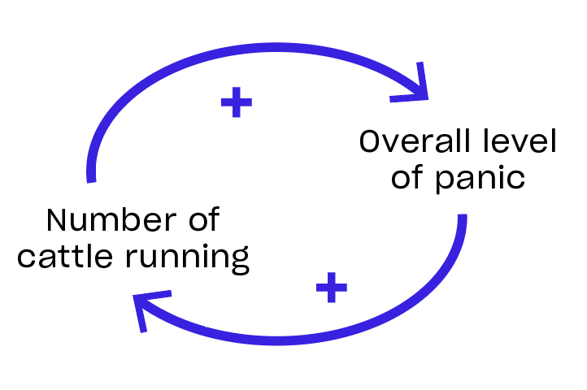

!Quote 2

## This is Not a Manifesto

History shows us that manifestos can give rise to monolithic, centralized movements, form in-group and out-group dynamics, and lead to forms of social organizing that are far too easy to topple or capture. Instead of a call simply to rise up and overthrow a system of power over others only to replace it with a new one, this is a call to root down into the places we call home and rise up together into a new epoch of shared power and shared responsibility.

This is also not a fully formed schematic of a perfect utopia. Utopias are neither real nor useful. We are protopian systems thinkers, more concerned with systems of care and a culture of profound empathy that help us to incrementally move forward together as one pluralistic and polycentric social body and planetary superorganism. This process will continue far after we die and will take countless shapes as our descendants determine for themselves what constitutes a more beautiful world.

We draw our inspiration from the [Sunflower](https://en.wikipedia.org/wiki/Sunflower_Student_Movement) and [g0v](https://g0v.tw/intl/en/) Movements in Taiwan, the [Democratic Autonomy](https://en.wikipedia.org/wiki/Autonomous_Administration_of_North_and_East_Syria) movement in Rojava, the [Sarvodaya Shramadana](https://www.sarvodaya.org) movement in Sri Lanka, the compelling research and community organizing of thinkers and activists like [Buckminster Fuller](https://www.bfi.org), [Vandana Shiva](https://vandanashivamovie.com), [Barbara Marx Hubbard](https://www.co-intelligence.org/newsletter/BarbMarxHubbardStory.html), [Nora Bateson](https://batesoninstitute.org), [Michel Bauwens](https://p2pfoundation.net), [Forrest Landry](https://www.youtube.com/playlist?list=PLZbbT5o_s2xqDHOmOBdpjr9yooMhJrSxP), [Daniel Schmachtenberger](https://civilizationemerging.com/media/), [Joanna Macy](https://www.joannamacy.net/main), [Audrey Tang](https://www.plurality.net), [Glen Weyl](https://www.plurality.net), [Nathan Schneider](https://nathanschneider.info/books/governable-spaces/), [Richard Flyer](https://richardflyer.substack.com), as well as organizations like [Radicle Civics](https://radiclecivics.cc), [RadicalxChange](https://www.radicalxchange.org), [Design Science Studio](https://www.designscience.studio), [Moral Imaginations](https://www.moralimaginations.com), and [The BioFi Project](https://www.biofi.earth).

In earnest, we are imagination activists and pragmatic futurists, unwilling to accept the status quo of a sick planet and a sick humanity, driven to methodically adapt human civilization from the ground up.

## What is a Civilization

A civilization is a collectively and dynamically composed construct. Put simply, our society is the product of the often unconscious and implicit cultural and systemic agreements that we enter into in order to participate. These agreements are shaped by our culture, formalized through our [infrastructures, incentives and institutions](https://education.nationalgeographic.org/resource/key-components-civilization/) and enacted through our interactions, which all coalesce to reinforce the particular patterns of production, consumption, and reproduction we call “society” or “civilization.”

Infrastructures can be understood as underlying resource mechanisms like money, energy, supply chains or law that mediate or enable specific types of interactions. Incentives can be understood as reward mechanisms for taking particular actions. Institutions can be understood as the social mechanisms that govern the behavior of individuals within a community. Together, these foundations determine what we can create and what we will be rewarded for creating (production), what we are able to consume (consumption), and what kinds of agency we have to modify and perpetuate these systems (reproduction). The flows of resources, information, and currency move along the river banks created by these institutions which, in our current epoch, perpetually reinforce well worn patterns of rivalry, scarcity, and extraction.

Human civilization is, in effect, a decentralized metabolic process, moving energy around the planet while shifting its form. As a phenomenon, this is neutral. Ants create ant hills. Birds create nests. Foxes create burrows. Humans create civilizations. As fundamentally social, relational beings, hardwired by our evolutionary programming to form tribal groups, we are naturally inclined to reproduce the social constructs of our civilization within the space defined by our infrastructures, incentives, and institutions.

We collectively uphold and signal our alignment with these structures in order to belong to, and survive within, the human social organism into which we are born. As such, we are all responsible for participating in and maintaining the current epoch of human civilization which has produced a particular series of self-reinforcing effects and outcomes that could be called ecocide, technocracy, late-stage capitalism, or the meta-crisis. As a catch-all descriptor for our many concurrent crises, the meta-crisis describes an interconnected set of crises whose common feature is their systemic and self-reinforcing nature.

As Stafford Beer says, “[the purpose of a system is what it does](https://en.wikipedia.org/wiki/The_purpose_of_a_system_is_what_it_does).” In our current times, it seems as though the purpose of our civilization is to concentrate wealth and power while externalizing costs to the commons, resulting in ecological and social collapse as centralized power and externalized costs exponentially accelerate. Despite the narratives of “progress” and “democracy,” a simple analysis of the outputs of our current civilization reveal that these narratives are, in fact, window dressing for a system that is failing to produce a healthy biosphere and a thriving quality of Life for humans.

These self-destructive phenomena are not so fatalistically bound to human nature as [“capitalist realism”](https://en.wikipedia.org/wiki/Capitalist_Realism) would have us believe. They are merely emergent outcomes based on the underlying set of agreements that form our infrastructures, incentives, and institutions, all of which combine to create the enabling structures of [ecocidal](https://www.stopecocide.earth/) and anti-social behaviors. These agreements, and the systems they inform, can be modified and transformed. Our history is replete with examples of these shifts occurring, most notably in the formation of the United States of America, a phase transition of power from a monarchic empire into a relatively self-governed nation. The founders of the United States were neither mythic beings with superhuman powers nor evil supervillains. They were, in fact, humans just like you or I, products of their time with the audacity to leverage the power of the word and collective action to invoke a [democratic and isonomic](https://en.wikipedia.org/wiki/Isonomia) [social contract](https://iep.utm.edu/soc-cont/).

To better understand how we might reform our social contract by fundamentally shifting the underlying agreements of our current epoch, it is critical to describe the often invisible structures that compose our current global order and that have failed to produce wellbeing for people and the planet.

For the last 250 years, the state and the corporation have been the foundations of our species’ first-ever globalized civilization. Implicit in both of these structures are the fundamental agreements of a rivalrous, zero-sum worldview in which hierarchical, bureaucratic institutions and extractive, capital-accumulating corporations govern the majority of human interactions and relationships. While this set of agreements or worldview seem “natural” or inherent to many humans today, prior civilizational agreements have been mediated by religious institutions, royal aristocracies, militaries, mercantile marketplaces, and feudal lords.

This abridged list of civilizational forms is offered merely to illustrate that civilizational forms are not fixed despite such an appearance to those who live within them. The Roman Empire likely seemed eternal to many Romans even as invaders were at the gate. The underlying agreements of our civilization are [“like water”](https://youtu.be/eC7xzavzEKY?si=gjyJc5SMC08GBubg) in that we are so subsumed by them that we take them for granted as intrinsic, barely even noticeable. But the cracks in the edifice of our current civilization are showing, reminding us that these are no more than collective agreements that can be changed. Shifting these agreements is an inter-generational phase transition, a challenging but necessary process that requires an ontological shift and deep cultural transformation.

## The Ontological Shift

An ontological shift can be seen as a transition from one way of understanding what exists or what it means to exist, to another, potentially radically different way of seeing and being. Changing one’s ontology involves moving from one conceptual framework about reality to another, which can have profound implications for how we understand and interact with the world around us. The existential crises we face today offer us an initiatory challenge and opportunity to transmute collapse into rebirth, an opening to reflect on and evaluate the ontological basis of our current civilization. And through this free fall between epochs of history, we are liberated to heal the wounds of humanity’s past and re-integrate ancient and nearly-forgotten ways of knowing ourselves and the world; a profound socio-cultural transformation from a worldview of fragmentation and [separation to a worldview of interbeing](https://charleseisenstein.org/videos/video/separation-vs-interbeing/) and mutual interdependence; from a worldview of dominance and competition to a worldview of harmony and co-creation.

This ontological shift is already underway all around the world, despite the appearance of stagnancy driven by the media and legacy institutions. Legacy institutions will hold onto their ontological assumptions far longer than the general public as the result of the massive edifices and sunk costs embroiled in the foundations of our current epoch, motivated by intrinsic incentives to maintain a status quo that disproportionately benefits those who have already enclosed and are extracting from the commons we share. But if you look beneath the surface into emerging subcultures around the world, a new ontology is already emerging and traditional indigenous ways of being and knowing are being revitalized. Those who undertake this courageous cultural transformation have already begun to discover new ways of being that integrate different cultures and value systems to meet the converging challenges of our present context.

Joanna Macy describes this transition as [“The Great Turning,”](https://www.ecoliteracy.org/article/great-turning) a civilizational phase transition from an industrial growth society into a life-affirming society. Amidst this transition, Macy notes the three dimensions of The Great Turning as holding actions that slow the damage, analysis of structural causes and the creation of structural alternatives, and shifts in consciousness. While this thesis focuses more explicitly on an analysis of structural causes and the creation of alternatives, shifts in consciousness are often where deeply transformative changes first begin.

At the core of this ontological shift is a new story of what it means to be human on the planet we call home. While our most recent epoch of human civilization was formalized upon the underlying agreement that we are rational actors engaged in a zero-sum competition for scarce resources and dominance, contemporary biological, sociological, psychological, metaphysical, and complexity sciences tell a different story. These new and ancient understandings reveal that our relationships are what make our lives possible, rich and meaningful – and that the health of these relationships determines the health of the whole. An equally material and metaphysical insight, akin to the Buddhist notion of interbeing or the Zulu philosophy of Ubuntu, our collective futures are inescapably bound together.

> “In a real sense all life is interrelated. All men are caught in an inescapable network of mutuality, tied in a single garment of destiny. Whatever affects one directly, affects all indirectly. I can never be what I ought to be until you are what you ought to be, and you can never be what you ought to be until I am what I ought to be...This is the inter-related structure of reality.” ― **Martin Luther King Jr., Letter from Birmingham Jail**

Within this emerging ontology, humans reimagine themselves as intrinsically part of and responsible for the vitality of our planet, our communities, and our commons. We are transformed from passive citizen-subjects and consumers into active citizen-participants and stewards. Our sense of personal well-being, once limited to the lens of the isolated and fragmented individual, nuclear family, nation or ethnicity, is being challenged by our current existential civilizational crises to evolve into a more holistic perspective.

Civilization-scale decay, made visible through the crises of homelessness, addiction, mental health epidemics, wealth inequality, ecocide, and the proliferation of potentially dangerous exponential technologies like AI and gene editing, reveal that there is no refuge, no place in our globalized civilization that is insulated from the risks and impacts of existential civilizational collapse and deteriorating quality of life. While our fates have always been bound together, these runaway existential risks make our mutual interdependence visceral, obvious, and un-ignorable.

This realization is the basis for a kind of sacred civics as a transcultural, transreligious, and transpolitical understanding of our mutual belonging and mutual responsibility. This emerging civic virtue exists at the immanent substrate of our material reality, not needing to leverage any metaphysical claims to bind our culture and systems to an ethical foundation of care, reciprocity, and mutuality. [Scientifically and spiritually](https://www.youtube.com/watch?v=If2Fw0z6uxY), our individual survival and thriving are increasingly bound together by either the game theoretic lose-lose or all-win reality of the meta-crisis’ runaway feedback loops. While many of our current systems reinforce an ontological frame of anti-social and ecocidal competition, our capacity for self-destruction, accelerated by the emergence of exponential technologies, requires a transformation in our fundamental relationships between self and other to reflect our new understanding of the interdependent nature of reality. By facing the reality that “[rivalrous dynamics, multiplied by exponential technology, are inherently self-terminating,”](https://www.thealternative.org.uk/dailyalternative/2021/4/26/schmachtenberger-consilience-project) we confront the existential mandate for humanity to evolve into a non-rivalrous, mutually responsible planetary species.

Drawing inspiration from the [Buen Vivir](http://www.gudynas.com/publicaciones/GudynasBuenVivirTomorrowDevelopment11.pdf) movements in Bolivia and Ecuador as well as the [Gross National Happiness](https://ophi.org.uk/gross-national-happiness#:~:text=The%20phrase%20'gross%20national%20happiness,holistic%20approach%20towards%20notions%20of) Commission in Bhutan, we can see systemic implementations of this ontological shift towards inter-being and commons stewardship. Particularly in the Buen Vivir model, institutionalized in the [Bolivian](https://www.tni.org/files/download/beyonddevelopment_buenvivir.pdf) and [Ecuadoran](https://rapidtransition.org/stories/the-rights-of-nature-in-bolivia-and-ecuador/) constitutions, well-being is described through an indigenous understanding of the mutually reinforcing relationships and scales of well-being, integrating individual, familial, communal, and ecological health. While these constitutional and governmental applications of an ontological shift have been difficult to reinforce due to the lingering effects of extractive multinational corporations, they offer a vision of an alternative approach to systems of governance and economy based on a new way of being.

Ontological shifts begin within an individual’s beliefs, coalescing into social agreements and norms. Thus, no one can choose to make an ontological shift on our behalf. A new world only emerges when we choose a different way of being, courageously stepping outside of the confines of the unhealthy societal agreements that define many aspects of our current paradigm. Beginning in small pockets or [“islands of coherence”](https://www.systeminnovation.org/blog/five-lessons-from-system-shifters-lesson-three) which evolve into [“systems of influence”](https://fojournal.org/report/islands-of-coherence/) through network effects, this emergent worldview will gradually develop its own culture, institutions, incentives, and infrastructures that [“make the old system obsolete.”](https://www.bfi.org/about-fuller/big-ideas/systems-change/) As such, embedding this ontological shift into explicit new social agreements, formalized through the design of new open civic systems aligned with the life-centric principles of pluralism and mutually interdependent collective agency, becomes an existential imperative for the continuity of human civilization and perhaps Life on Earth. This simultaneously cultural and systemic intervention is an essential strategic leverage point or [“trim tab”](https://www.huffpost.com/entry/the-power-of-trimtabs-wha_b_5863520?utm_hp_ref=impact&ir=Impact) to shift our planetary macro socio-economic order. In this context, civic innovation can be viewed as the emergent creative impetus driving us to imagine and build the foundations of what could be called a “life-affirming civilization.”

## What is Civic Innovation

Despite a contemporary connotation with roads, bridges, and arduous town hall meetings, the [origin of civics](https://en.wikipedia.org/wiki/Civic_Crown) relates to an act of service, the choice to care for the life of another for no reason other than a profound devotion to the web of relationships that make our lives possible. Reclaiming this original spirit in a contemporary context, civics is both the creation and stewardship of civilizational systems of care.

In our contemporary context of centralized bureaucracies and corporations, little is currently expected of citizens with regards to civic service, the stewardship of our commons and communities. Where centralized government agencies do provide a necessary function of scale, they are often [ineffective at resource allocation](https://www.reuters.com/world/us/pentagon-fails-audit-sixth-year-row-2023-11-16/) and are [vulnerable to corruption and capture](https://act.represent.us/sign/problempoll-fba). The current role of citizen has devolved into either that of a passive recipient of government services or a voter for various levels of bureaucracy and executive authorities.

Humanity is beginning to remember that, as participants in civil society, we are all citizens of our world, and it is our mutual responsibility as citizens to serve as civic stewards. As civic stewards, it’s up to us to create the conditions of mutually assured thriving. The choice to be a civic steward is to take responsibility for our civilization with courage, creativity, and devotion.

And when our systems of civic stewardship are insufficient to empower the necessary adaptive response to shifting circumstances or crises, some civic stewards rise into the role of civic innovator. The choice to be a civic innovator is to take responsibility for the improvement of civic systems that empower others to be civic stewards.

Civic innovation is the collaborative improvement of civic systems that are important for the public good. Civic innovation seeks to restore and renew the spirit of collective stewardship of our commons and communities by providing novel mechanisms for civic stewardship. When our legacy civic institutions fail to provide such mechanisms for holistic well-being and collective stewardship, it falls to us as innovators and as citizens to define and implement our own solutions.

The scope and scale of civic innovation required to meet our present moment of existential risk and civilizational collapse is unique in the course of human history. While all epoch-defining transitions have been consequential and all-consuming, never before has a globalized human civilization, equipped with existential exponential technologies, engaged in the degree of socio-economic reconfiguration required of us now. And yet, we can take heart in the knowledge that such transitions have occurred, however messily, throughout the history of our species. In each case, the imaginations of the civic innovators of those times were constrained and informed by the civilizational failures that they experienced. In our particular case, we are directly facing a world mired in the disastrous consequences of exponentially centralizing wealth and power. In dialogue with the systemic nature of these outcomes, we can envision a pluralistic society in which our civic infrastructures localize and distribute flows of resources and decision-making authority via open, participatory, and composable mechanisms.

This spirit of responsible civic stewardship as innovators calls for an open civics: a design philosophy for distributed collaboration and civilizational stewardship that engages in the evolutionary adaptation of our core civilizational systems via the direct participation of citizens. This philosophical approach engages the public and all relevant stakeholders in a participatory design process that empowers civic organizers, innovators, and patrons to work better, together. An “open civics'' implies an approach to civic innovation that is non-rivalrous, non-enclosable, self-determined, and composable by citizens. These civic innovations can be best conceived as “open protocols,” patterns of human coordination that provide the same civilizational services and utilities as traditional institutions using a networked approach.

The emerging Decentralized Civics (DeCiv) movement is modeling networked civilizational systems based on the pluralistic and participatory development of open-source software, [stigmergic](https://theanarchistlibrary.org/library/kevin-carson-the-stigmergic-revolution) living systems patterns, open standards bodies, the symbiotic intelligence of an artistic or cultural scene, and commons self-governance principles. In an open civic system, institutions are supplemented or altogether replaced by [extitutions](https://extitutions.org/about) (external, open organizations), infrastructures by open protocols (open-source, decentralized systems), and extractive incentives by prosocial incentives (rewards that encourage cascading benefits).

A key historical example of extitutional self-organization is the [Free Breakfast for School Children Program](https://en.wikipedia.org/wiki/Free_Breakfast_for_Children) (or the People’s Free Food Program), a community service program run by the [Black Panther Party](https://en.wikipedia.org/wiki/Black_Panther_Party) that provided free breakfasts for children before school. The program emerged in direct response to the inadequacies of the federal government's under-resourced public school lunches. Run almost entirely by volunteer women from neighborhoods across the United States, this self-organizing pattern was a key political strategy for the black nationalist movement as it revealed the community’s collective power to meet their own needs without relying upon large institutions. The FBI’s [COINTELPRO]([https://en.wikipedia.org/wiki/COINTELPRO#:~:text=COINTELPRO (a syllabic abbreviation derived,American political organizations that the) attacked and defamed the breakfast program and then, in the early 1970’s, Governor [Ronald Reagan's](https://en.wikipedia.org/wiki/Ronald_Reagan) administration created a statewide free breakfast program with an underlying objective to [seize the political power](https://en.wikipedia.org/wiki/Free_Breakfast_for_Children#Demise) the Black Panther Party had gained. By enabling and empowering this type of civilizational stewardship from the bottom up through technological and social mechanisms that are inherently evolutionary, consensual, and adaptive to our current crises, we meet the existential failure modes of our current systems through the development of cosmo-local design patterns.

[Cosmo-localism](https://www.cosmolocalism.eu) refers to the dynamic interplay between global coordination and hyperlocal participation. The notion of cosmo-localism allows for self-determination at the most local scale of an infrastructure or design pattern while enabling scaling, federation, and nesting into larger social bodies or associations. This pluralistic and composable approach to infrastructures, incentives, and institutions is simultaneously a strategy for enhanced [system anti-fragility](https://www.nature.com/articles/s44260-024-00014-y) as well as an evolutionary feedback cycle that preempts the kinds of institutional decay and capture we face today. By designing civic systems according to this design philosophy, we envision an exciting new phase of open civic innovation; a [Cambrian explosion](https://en.wikipedia.org/wiki/Cambrian_explosion) of experiments in self-governance and self-determination that transforms the blighted landscapes of our social and ecological commons into a thriving [substrate](https://mirror.xyz/exeunt.eth/nQuVW2CCwhZUgKwxTdbNAM0x-vDp5GtFtodHkkQg31Y) for mutual solidarity and well-being.

When networked together in the spirit of mutual solidarity through processes of consensual alignment at global and local scales, these experiments enable the development of [dual power](https://theanarchistlibrary.org/library/wesley-morgan-building-dual-power) in place and [network effects](https://www.nfx.com/post/network-effects-bible) online, which can be leveraged to adapt or replace legacy institutions. Highly localized experiments in alternative civic systems which neglect the design imperatives of global interoperability may face an existential threat, remaining insular and vulnerable to cooptation or out-right destruction by legacy institutions and incentive models if they lack networked support, legitimacy, and funding. If successful, this distributed movement of alternative civic systems, modeled on the underlying [ontology of interbeing](https://www.google.com/url?sa=t&source=web&rct=j&opi=89978449&url=https://scholarworks.iu.edu/iupjournals/index.php/jwp/article/download/4914/349/21680&ved=2ahUKEwjo0Kj0gp6JAxWCLdAFHSS-Cd4QFnoECDEQAQ&usg=AOvVaw3JSW-Wv5jXm-JuzG4mWiN6), will form the foundations of a parallel society, a fork of our current civilization that will gradually draw energy, resources, and attention from our legacy systems. Investments in these parallel systems offer a pathway to [compost capital](https://www.postcapitalistphilanthropy.org) through close loop value chains, removing our need for continuous non-profit funding by creating alternative economies that shift the incentive landscape from the grassroots to bioregional to planetary scales.

Historical examples of similarly innovative civic experiments range from the [Zapatista Movement](https://nacla.org/news/2022/12/21/spark-hope-ongoing-lessons-zapatista-revolution-25-years) in Mexico to the [Sunflower Revolution](https://www.theguardian.com/world/2024/mar/21/what-is-taiwan-sunflower-movement-china) in Taiwan and the Democratic Autonomy Movement in Rojava. The [Democratic Autonomy](https://www.opendemocracy.net/en/north-africa-west-asia/rojava-revolution/) movement in Rojava arose in the context of institutional collapse during the Syrian Civil War, filling a power vacuum created by the conflict. Their anarcho-socialist parallel society prevails amidst these precarious conditions. While the Zapatistas have maintained their own social contract for decades without being captured by the Mexican federal government, they have failed to leverage their dual power to influence their legacy institutions to the same degree that the Taiwanese Sunflower Movement achieved. The Taiwanese protest movement culminated in a negotiated deal that successfully asserted new forms of  participatory civic innovation into their existing institutions through the vTaiwan and g0v programs and methodologies. These contrasting approaches reveal the strategic necessity to assert influence and develop dual power for the success of nonviolent social movements.

DeCiv also draws inspiration from the decentralized science movement, or [DeSci](https://www.coingecko.com/learn/what-is-desci-decentralized-science), which posits that the scientific method can be applied through egalitarian, decentralized means, effectively opening the process of scientific discovery beyond the boundaries of large academic institutions. Similarly, decentralized civics is a field of applied research conducted by citizens, technologists, and community organizers to develop and deploy novel civic systems as open-source, participatory public protocols that provide for critical civilizational functions.

We envision a future in which open civic innovation evolves into a widely recognized and well-compensated field of prosocial socio-technical design, in which all citizens are empowered to listen to the needs of their communities and develop new civic systems that directly improve their community’s quality of life.

To formalize, engage, and ethically steward this emerging field of practice, we feel it is necessary to form the OpenCivics Network, a community of practice and coordinating body for civic innovators, community organizers, and patrons in the civic domain. Similar to the role the [Token Engineering Commons](https://tecommons.org) has played in the emerging field of token engineering by providing legitimizing and scientific grounding, we feel a responsibility to ensure an ethical and coordinated effort amongst civic innovators to create foundational utilities that empower civic stewardship and serve collective well-being.

The applied field of civic innovation and civilization system design has many antecedents and draws from many related disciplines, [new](https://radiclecivics.cc) and [old](https://www.thevenusproject.com). To catalyze a revitalization of the field and empower a more distributed approach to civilizational design while maintaining a shared ethical foundation, this thesis proposes three civilizational health indicators.  These indicators offer lenses through which we can evaluate and understand the outputs of any open civic system that we may contribute towards as innovators:

**Vitality** is Life’s capacity to create more Life, the embodied state of thriving that emerges from the interconnected levels of well-being and quality of life for individuals, communities, and ecologies.

**Resilience** is the state of and the capacity for adaptive self-organization sufficient to provide core life-support function across changing world circumstances.

**Choice** is the state of fundamental respect for the sovereign agency of all beings and the capacity of individual agents to express their agency and influence their circumstances.

These principles have been derived and distilled from a combination of systems thinking and first principles outlined by thinkers like [Donella Meadows](https://donellameadows.org/archives/leverage-points-places-to-intervene-in-a-system/), [Elinor Ostrom](https://ostromworkshop.indiana.edu/library/bibliographies/ostrom-elinor.html), and [Daniel Schmachtenberger](https://consilienceproject.org). In particular, Daniel Schmachtenberger’s insights on the systemic drivers of the crises we face have provided a critical set of design criteria for new systems, new infrastructures, institutions, and incentives that are sufficient to effectively respond to and address what Daniel calls “the meta-crisis.”

## Our Context is Crisis, Our Crisis is a Birth

As renowned futurist Barbara Marx Hubbard said, “[our crisis is a birth]( https://www.amazon.com/Hubbard-Barbara-Marxs-Revelation-Co-Creation/dp/B008ZRF7GW).” The systemic breakdowns we face necessitate the emergence of entirely new systems and ways of being, reconstituting, renewing and reimagining ancient cultural foundations at a planetary scale for the first time. Never before in our history has our existential self-destructive capacity forced us to understand at the planetary scale how to explicitly align the underlying agreements and mechanisms of human civilization with living systems principles. We have had the freedom, throughout our adolescent history as a species, to explore many different expressions of how civilization could be organized. Now, our exponential technologies, driven by rivalrous dynamics to the brink of total species annihilation, are offering us a choice. We can either learn how to design and bind the underlying agreements of our cultures and systems in alignment with living systems principles and the holistic stewardship of the well-being of our planet, shifting the fundamental context of our modes of production, consumption, and reproduction, or we will destroy ourselves. While this proposition seems daunting, this alignment is materially the only viable path through the eye of the needle available to us as a species due to the runaway feedback loops of [exponential technologies](https://youtu.be/LtbMps1PDFc?si=r7OKqJ1QlhpRSctv).

Looking at the world around us, it isn’t difficult to see that we live in a world in crisis. Ecocide, biodiversity collapse, climatic shifts, extreme weather, mass climate migrations and refugees, catastrophic topsoil degradation and food system collapse, homelessness, mental health epidemics, ideological fragmentation and escalating polarization, chronic illness, wealth inequality and economic centralization, national and personal debt crises, inflation, the potential of peak oil, the rising costs of energy, resource extraction, genetically engineered bioweapons, the truth and meaning crisis, and severe social transformations and risk as Artificial Intelligence progresses are among the many runaway crises we face as a species.  These converging crises are an existential threat to human civilization.  At this stage in the exponential curve of multiple runaway crises, a collective fundamental phase-shift is _extremely urgent_. Interoperable transition methods and a shared sense of global human solidarity are critical to our species’ longevity and survival.

Underlying these seemingly distinct expressions of civilizational decay and collapse are a shared set of systemic dynamics reinforcing the exponential feedback loops that drive these anti-social and ecocidal patterns. As a whole, these patterns can be referred to as wicked problems, the polycrisis, or the meta-crisis. The self-referential quality implied by the term *meta-crisis* refers to the particular self-reinforcing quality of systemic feedback loops whose [path-reinforcing](https://civilizationemerging.com/catastrophic-and-existential-risk/) dynamics make self-correction [more and more difficult](https://www.lesswrong.com/posts/iwCRYnGYMvxgzrCMf/complex-systems-are-hard-to-control) as time passes.

For example, in democracies around the world, the complex feedback loop of [“regulatory capture”](https://scholarlycommons.law.emory.edu/ecgar/vol1/iss1/4/) produces dynamics that undermine the public’s ability to utilize the mechanisms outlined in constitutional frameworks for representative self-governance. Many elected officials, even well-intentioned ones, are elected into office to make change, but by the time they have the power to make that change, they are often already so influenced or inhibited by the incentives of corporate campaign finance and duopoly institutional entrenchment that they cannot effectively represent the will of the people who elected them. These elected officials may make some nominal or superficial gestures toward transformational change, but ultimately they are beholden to the already-captured institutions that provision them with access to power.

From the race to [Artificial General Intelligence](https://youtu.be/xoVJKj8lcNQ?si=_QFeixci8EMLWXeR) to the [attention economy](https://youtu.be/y5rn1qp2aZc?si=Q0oasRvU20XdfDm0) to [military spending](https://www.nationalpriorities.org/campaigns/us-military-spending-vs-world/), multi-polar traps are system dynamics in which mistrust and rivalry force competing corporations and governments to continuously accelerate their tactics without regard for the consequences for and negative externalities to society. The behavioral dimension of a multi-polar trap is driven by the belief that “if I didn’t do it, someone else would.” This self-fulfilling logic, driven by an economic system that rewards these behaviors regardless of their existential risks they generate for humanity, creates a “race to the bottom” which risks the continuity of Life on Earth in favor of short term profits.

In the contexts of socio-economic, technological, and military industrial systems, the system dynamics of multi-polar traps, the [tragedy of the commons](https://online.hbs.edu/blog/post/tragedy-of-the-commons-impact-on-sustainability-issues), and recursive accumulation of wealth and power form a nearly impenetrable mess of misaligned incentives and runaway feedback cycles. In an ideal world, democracies would provide a countervailing influence on unrestrained, centralized corporate power, but the same forces that drive extractive and anti-social behaviors in the corporate sector have overtaken our democracies.

Seen in this context, _the meta-crisis is a coordination and adaptation failure_, a civic crisis stemming from the long term effects of separation, rivalry, and the consolidation of wealth and power on the public’s ability to govern itself effectively. If markets, governments, and multinational corporations are _systemically_ incapable of coordinating a response to the interconnected crises we face, it becomes self-evident that reformist efforts are ultimately insufficient to address our crises at the root. In actuality, despite the techno-optimism that occurs in elite conferences around the world, corporate-driven reformism not only distracts from the underlying system dynamics but also prolongs the perceived legitimacy of legacy institutions. While [holding actions](https://workthatreconnects.org/dimensions-of-the-great-turning/) can slow the progression or reduce the harm caused by these systems, the systemic and self-reinforcing nature of these runaway processes implies that much deeper transformational actions are required to preserve the continuity of human civilization and perhaps even Life on Earth.

In short, the meta-crisis represents a nested set of feedback loops that not only drive exponential acceleration of existential risks but increasingly undermine our collective capacity to address those risks within the internal processes of our captured systems. In both our democracies and economies, these systemic drivers of runaway crises have consumed and undermined the capacity of elections and markets to mitigate them. Thus, we as a public have no choice but to formalize our own civic systems that address the failure modes of our current systems.

To design whole systems alternatives that avoid reproducing these failure modes, it becomes necessary to review the game theoretic probable outcomes driven by these current systemic dynamics. Only with a sufficient understanding of the impending collapse scenarios that loom on the horizon can we successfully generate [anti-fragile](https://en.wikipedia.org/wiki/Antifragility) coordination mechanisms that are sufficient to meet the crises we face. Schmachtenberger refers to the three probable outcomes from current runaway feedback loops as [“the three attractors.”](https://youtu.be/8XCXvzQdcug?si=E0h--4Fv-AVinxhG) The phrase [“attractor”](https://en.wikipedia.org/wiki/Attractor) is a reference to chaos mathematics, a field of study regarding complex systems in which the number of and interactions between variables make linear models and predictions impossible. Attractors, or basins of attraction, refer to the bounds of a system which can be known even when the specific outcomes within those bounds are unknowable. While we can’t predict the exact outcomes of the nested and complex systems that are driving the meta-crisis, we can make a reasonably informed prediction of the future systemic equilibria that may emerge as these feedback loops reach the exponential curves that we are now approaching or, in some cases, have already entered. The three probable attractors that Schmachtenberger predicts based on his game-theoretic study of current dynamics are chaos, authoritarianism, and distributed coordination.

The chaos attractor is defined by the collapse of institutions and centralized authorities under the weight of a plurality of distributed crises that fracture those institutions’ ability to maintain legitimacy and control. In the absence of a new, mutually accepted social order, systems devolve into tribalism and neo-feudalism with different clusters of actors vying for power, legitimacy, and control, likely at the regional scale. This attractor implies a high likelihood of not only civilizational collapse but potentially human extinction.

The authoritarian attractor is defined by a techno-fascist crack down on individual agency in order to retain a sense of social order in the face of accelerating breakdowns and crises. We see early stages of this attractor emerging with online censorship and the rise of both globalized corporate authoritarianism as well as hyper-nationalist elected leaders who have leveraged xenophobia and a strongman ethos to gain power and influence. While both of those expressions of authoritarianism position themselves as antagonists to one another, they are mirror expressions of the same authoritarian attractor. Elites around the globe likely prefer this attractor as it allows them to retain power and wealth as collapse scenarios accelerate.

Lastly, the distributed coordination attractor is defined by emergent, agent-centric self-organization that is able to provide localized resilience to rapidly changing circumstances through decentralized mechanisms. Schmachtenberger calls this system equilibrium “the third attractor,” a reference to the narrow path of systemic adaptation that simultaneously addresses the failure modes of our current systems while increasing the probability of avoiding the other two attractors. This attractor would result in a vast redistribution of wealth and agency, making it unappealing to elites but demonstrably more equitable, regenerative, and life-affirming than the other two possible attractors.

In this context, it becomes an ethical and strategic necessity to orient humanity’s collective agency towards defining, designing, and deploying civic systems that create the enabling conditions for the third attractor.

Such systems would require three design principles to guide the development of modular, composable, and interoperable civic systems that optimize for the third attractor and avoid unintentionally reproducing the self-destructive qualities of our current civilization. Our critical path towards a life-affirming civilization is defined by self-correcting feedback loops, aligned incentives, and civic culture.

Self-correcting feedback loops refers to truly participatory democracy paired with a sufficiently educated public able to interpret the holistic impact of our collective agency. Distributed, powerful, collective agency is required to ensure that any unhealthy feedback loops that may emerge at any point in our collective future can be addressed and mitigated holistically. This can be achieved through direct democracy mechanisms, citizen assemblies, strong public education, traditional ecological knowledge and open socio-ecological data.

Aligned incentives refers to an incentive landscape in which individual self-interest is aligned with the collective interest of humanity and all Life on Earth. Pro-social incentives reward forms of value that create cascading benefits for humanity and the planet. Unlike our current incentive landscape which rewards extraction and enclosure of value, prosocial incentives reward contributions to the commons and markets that produce holistic well-being and mutual thriving. This can be achieved through an economic structure organized by a diverse array of different strategies like democratically governed worker-owned cooperatives, nature-backed currencies, and evaluative metrics like Gross National Happiness.

Civic culture refers to the revival of a commonly practiced culture of mutual stewardship and responsibility. Renewing our sense of mutuality and solidarity is a critical precursor to any of the downstream behavioral and socio-economic shifts described above. Deconstructing the weaponized culture war dynamics that are currently being leveraged to reduce collective agency by pitting identity groups against one another can be effectively achieved through the lens of bioregionalism. Bioregionalism represents a philosophy of mutual belonging to the places, watersheds, and biosphere we call home as a fundamental basis for solidarity. Civic utilities like informal solidarity networks, connected locally and globally, that share resources and provide grassroots coordination infrastructure for mutual benefit are among the tools that directly support this _civic cultural renaissance_.

Put together, these underlying systems design principles reflect what could also be called a “life-affirming civilization.”

Thus, this thesis attempts to offer a sketch of this design philosophy for distributed coordination, the basis of an open civics. This paper proposes an underlying participatory design methodology for self-organizing processes and resilient, place-based and cosmo-local infrastructures that provide the enabling conditions for a fundamentally post-capitalist and even post-nation-state human civilization. By providing an initial methodology that provides a process ontology for the fundamental elements, functions, and processes of distributed coordination, this thesis outlines both the core mechanisms of the OpenCivics Network as a set of emergent capabilities, as well as the Open Civic Innovation Framework as a coherent, overarching meta-framework for a participatory process of civilizational adaptation. By linking the many commons and peer-to-peer efforts to revitalize the civic design space, this framework provides a foundation for a fully distributed process, governed by those who engage in it.

This model is not intended to be complete or final in any sense, rather it offers a schelling point, a point of convergence and a starting point from which we might collectively, to coordinate the process of systemic adaptation and co-evolution.

This model is not intended to be complete or final in any sense, rather it offers a schelling point, a point of convergence and an underlying schema, to coordinate the process of systemic adaptation and co-evolution.

## A Post-Tragic Protopian Audacity

This proposed vision of possibility is inherently audacious. It invokes a radical reimagining of a human society rooted in love, care, and mutual responsibility. Such an audacious act of imagination is required to shift the [overton window](https://en.wikipedia.org/wiki/Overton_window) of perceived possibility. One of the greatest tools of manipulation used by systems of power is the belief that our current socio-economic order is a reflection of reality itself. A close examination of the natural world reveals that it is, in fact, cooperation and synergy that defines the success or failure of a species in the evolutionary process. This is also true of the evolution of human civilization.

This thesis emerged from direct experiences of awakening to a sense of the suffering of our world, a gradual and ongoing process of removing the veils of indoctrination to perceive the massive scale of violence, inequality, and injustice upon which our current society is based. Entering the trough of disillusionment as understanding of the depth of the crisis increases, it can be easy to choose either the path of dissociation and numbing or total annihilating grief. Both choices are entirely reasonable given the scale and profound tragedy of loss of human life and the mass extinction of other species, but a third response, holding the grief and possibility simultaneously, is also available. The [post-tragic](https://systems-souls-society.com/post-tragic-event-with-zak-stein-and-marian-partington/) aesthetic and sensibility emerges through the embrace of our grief and empathy as fuel for our creative action. We are motivated to reimagine our world not in spite of our current tragedies but because of them. Similarly, [solar punk](https://earth.org/solarpunk/) and [lunar punk](https://youtu.be/J_Pov8cO7O4?si=PS5Z5_bbxjtFXfEi) as aesthetic and cultural movements have emerged as similar expressions of the dynamic balance between radical optimism and sobering realism in the face of extreme crises.

The [radical reimagining](https://www.moralimaginations.com/imaginationactivism) of our human society emerges as an act of rebellion against the prevailing lack of socio-political imaginary that insists that capitalism is the only viable political and economic “forever” system. But unlike utopian claims that are usually driven by a single individual’s imagined design of alternative socio-economic frameworks, the radical reimagining proposed by this thesis instead offers a set of mechanisms and processes by which we may collectively dream and enact a new world into being.

[Protopia](https://www.nytimes.com/2023/03/14/special-series/protopia-movement.html), a term coined by futurist Kevin Kelly in 2009, refers to a society based on incremental and mutually determined progress. By taking incremental steps forward together, grounded in our direct experience of reality and the collectively determined needs of our immediate communities, we are carving out alternative, imaginal spaces in which we can collectively dream and create a different kind of society together. Instead of proposing a utopian vision of how human society should organize itself, this thesis offers the OpenCivics Innovation Framework as a methodology for the distributed and collective process of civilization-scale transformation.

This transition will likely take place across a multi-generational time span before we arrive at a new, stable, system equilibrium, and it is a near certainty that the process will be disruptive and tenuous at points, but our audacity to dream of a more beautiful world as our current civilization degrades around us is the first step in that multi-generational process.

Our hearts have been broken thousands of times as we have felt and been transformed by the suffering of our world. The impulse to care and respond to this suffering is a natural response as empathic and social beings, a response that has been denatured by our social conditioning, wounding, and reliance on bureaucratic institutions to care for the collective on our behalf. Liberating this natural impulse to care for humanity and our world is the great work of these challenging times. Our choice to open our hearts after being let down again and again by our leaders and systems is a courageous one, but a more beautiful world can only emerge when we rise up together as a human species, facing the suffering of our world with compassion and wise action. We have the tools, methods, and frameworks ready at hand. From that place, an open civics is a call to awaken the spirit of care and compassion in the public and encode the spirit of non-rivalrous coordination among civic innovators, such that humanity can rise up together to collectively reimagine our world.